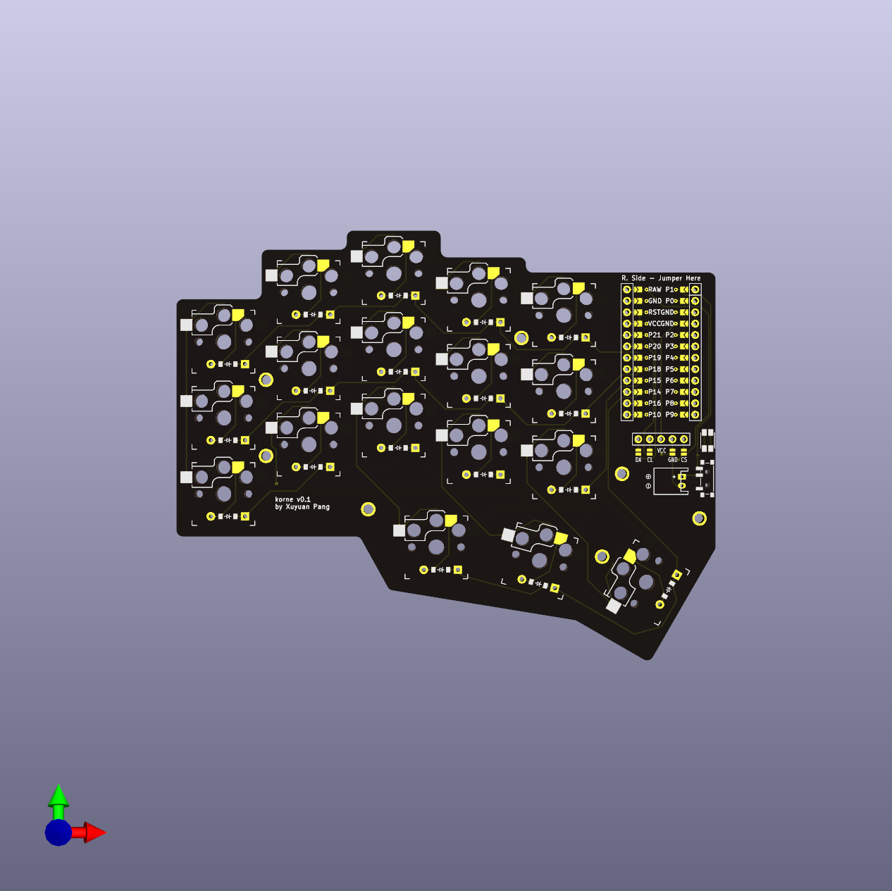
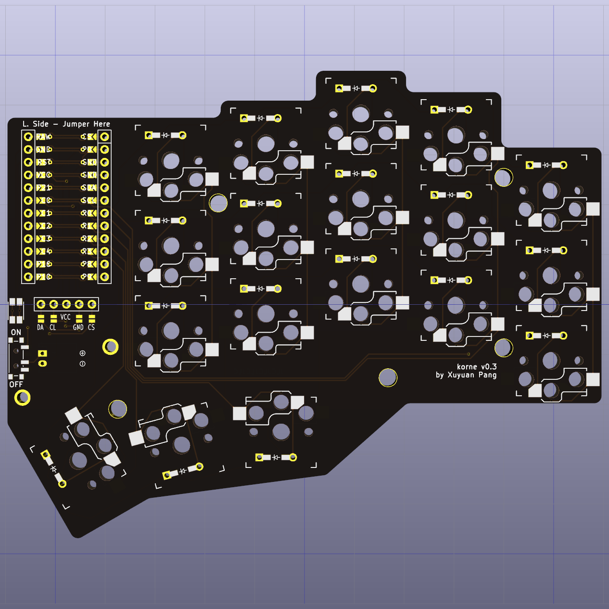

# Korne

| left                           | right                        |
| ------------------------------ | ---------------------------- |
|  |  |

# Features

- Declarative layout configuration (powered by ergogen)
- Reversible PCB design
- Nice!View support (not tested yet)
- Wireless only
- 3D printed magnetic cases
- Compatible with ZMK firmware of Corne
- Stagger fit my hands perfectly
