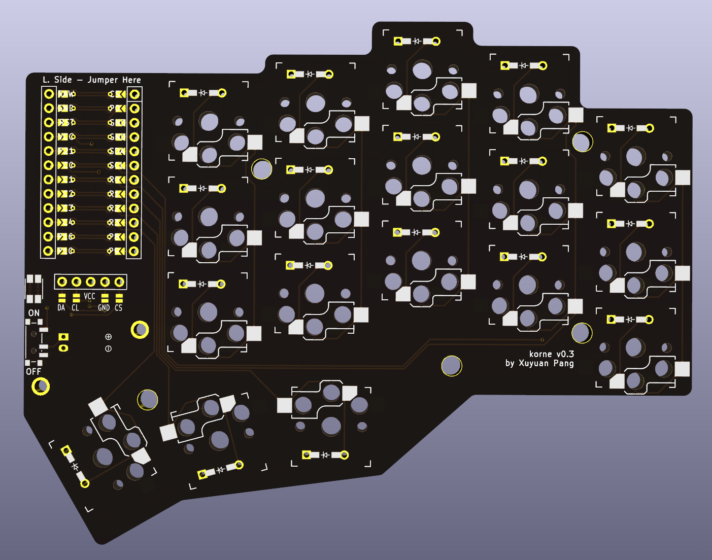

# Korne

| left                           | right                        |
| ------------------------------ | ---------------------------- |
|  |  |

## Features

- Declarative layout configuration (powered by ergogen)
- Reversible PCB design
- Nice!View support (not tested yet)
- Wireless only
- 3D printed magnetic cases
- Compatible with ZMK firmware of Corne
- The staggered layout fits my hands perfectly

## Credits

- [Ergogen](https://github.com/ergogen/ergogen)
- [ErgoPad](https://pashutk.com/ergopad/)
- [Flatfoot Fox's awesome blog](https://flatfootfox.com/ergogen-introduction/)
- [samoklava](https://github.com/soundmonster/samoklava)
